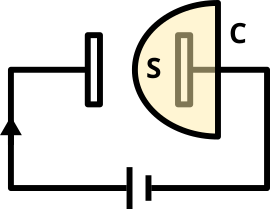

# Lei de Ampere-Maxwell 

## História

O interesse inicial que estimulou pesquisadores a investigar uma relação entre corrente e campo magnético decorreu de uma observação feita em 1820 por Hans Christian Ørsted, onde percebeu que agulhas magnetizadas eram desviadas por correntes elétricas. Com isso, diversos físicos começaram a estudar o assunto separadamente, e nisso André-Marie Ampère propôs um experimento focado em medir as forças que dois fios elétricos exercem um sobre o outro.

Com isso, Ampère formulou a lei conhecida com seu nome, a Lei de Ampère, em 1826, onde relacionou campos magnéticos associados a um circuito fechado à corrente eletrica que passava por eles. Na sua forma original, a corrente presa no loop só se refere a correntes vindas do movimento de partículas carregadas, o que causa alguns problemas na conservação de corrente elétrica e propagação da energia eletromagnética.

Em 1861, James Clerk Maxwell extendeu a lei de Ampère, introduzindo o conceito de corrente de deslocamento no termo de corrente elétrica para satisfazer a equação de continuidade de carga elétrica. Usando como base a corrente de deslocamento, Maxwell estabeleceu a teoria do campo eletromagnético. Somente no final da década de 1880, Heinrich Hertz provou com experimentos a existência de ondas eletromagnéticas, previsto teoricamente por Maxwell.

## Definição

Retomando a Lei de Ampère original, temos que ela relaciona o campo magnético que circula em um loop fechado com a corrente elétrica nesse mesmo ambiente. Porém, mudanças no tempo em campos elétricos devem produzir campos magnéticos, fenômeno esse observado por Maxwell e não explicado na lei original. 

A equação de Ampère-Maxwell é dada como o seguinte, sobre uma superfície $S$ e curva $C$, escrita da forma integral:

$$
\int_{S} \mathbf{\nabla \times b \cdot da} = \oint_C \mathbf{B \cdot dl} = \mu_0 \left( I + I_D \right).
$$

Onde:

$$
I_D = \varepsilon_0 \frac{d}{dt} \int \mathbf{e} \cdot \mathbf{\hat{n}} \ da.
$$

Temos então, visualizando de forma completa:

$$
\oint_C \mathbf{B \cdot dl} = \mu_0 \left( I + \varepsilon_0 \frac{d}{dt} \int \mathbf{e} \cdot \mathbf{\hat{n}} \ da \right).
$$

Sendo os termos:

- $\mathbf{B}$: campo magnético;
- $\mathbf{e}$: campo elétrico;
- $\mathbf{I}$: corrente elétrica que atravessa $S$;
- $\mathbf{I_D}$: corrente de deslocamento;
- $\mu_0$: permeabilidade magnética do meio;
- $\varepsilon_0$: permissivide elétrica do vácuo;
- $\hat{\mathbf{n}}$: vetor normal unitário à superfície $S$;

O primeiro termo da parte direita da primeira equação relaciona a corrente $I$ e o campo magnético $\mathbf{B}$ em torno de uma curva $C$. É a contribuição original feita por Ampère, onde $I$ diz sobre todas as correntes não dependendo do seu local de origem.

A segunda parte é a contribuição feita por maxwell e mostra que a circulação do campo magnético também é causada pela variação do fluxo elétrico. 

Temos com a adição de Maxwell uma simetria com a lei de Faraday, onde da mesma forma que a variação do fluxo magnético gera um campo elétrico, a variação do fluxo elétrico gera um campo magnético.

## Aplicação em um Capacitor

Seja um capacitor duas placas condutoras separadas por algum material dielétrico. Considere o processo de carga deste capacitor. Quando ele está em um circuito e uma corrente o atravessa, temos alguns acontecimentos:

- Antes de chegar às placas do capacitor, é pos["./capacitor.png"]sível medir a corrente elétrica $I$ no fio condutor.
- Entre as placas do capacitor, não há condução de corrente porque o material dielétrico impede o fluxo da carga $I$.

Temos que dentro do capacitor, mesmo sem a corrente, ainda existe um campo magnético detectável ao redor das placas. Isso mostra que a equação original de Ampère não consegue descrever o campo magnético em todas as situações, pois, na equação original:

$$
\oint \mathbf{B} \cdot d \mathbf{l} = \mu_0 I
$$

Como $I = 0$, não há explicação do porquê existir campo magnético detectável.

Maxwell corrigiu esse problema adicionando o termo de corrente de deslocamento, resultando na equação apresentada anteriormente. O temo adicionado diz sobre a corrente associada à variação no campo elétrico entre as placas do capacitor.

Logo, enquanto o capacitor está carregando ou descarregando, o campo elétrico $\mathbf{e}$ entre as placas se altera com o passar do tempo, e essa variação gera uma corrente de deslocamento - equivalente em termos de magnitude à corrente de condução que está alimentando o capacitor.

Podemos imaginar integrar sobre uma superfície $S$ que está associada a um caminho fechado $C$.

Esse exemplo nos mostra que a lei original não faria muito sentido sem a adição de Maxwell, que possibilitou avanços na área.

## Aplicações no Dia-a-Dia

Muitas das aplicações, mesmo extremamente importantes para o mundo moderno, estão sob algumas camadas de abstração e podem estar pouco distante do nosso cotidiano. Porém, diversas tecnologias que são essenciais atualmente utilizam conceitos de eletromagnetismo e tem a lei de Ampère-Maxwell como uma de suas bases, entre elas transmissão de dados por fibra optica e sistemas de carregamente sem fio.

Na transmissão de dados por fibra optica, os cabos transmitem informações por pulsos de luz, que é uma forma de onda eletromagnética. Por conta da lei de Ampère-Maxwell, sabemos que a mudança de campos elétricos podem criar campos magnéticos (o contrário também sendo verdade) e isso é utilizado para gerenciar a propagação de luz dentro do cabo.

Além disso, sistemas de carregamento sem fio utilizam conceitos abordados. Com a adição feita por Maxwell, é possível projetar dispositivos que carregam dispositivos como smartphones, por exemplo. Eles funcionam da seguinte maneira: coils geram campos magnéticos que variam de acordo com o tempo, com isso induzem correntes em coils próximos (o do dispositivo a ser carregado). Com o conhecimento adicionado, podemos transmitir energia por meios não metálicos!

A lei de Ampère-Maxwell abriu caminhos para avanços tecnológicos necessários para a sociedade atual, sendo um importante tópico no estudo do eletromagnetismo.